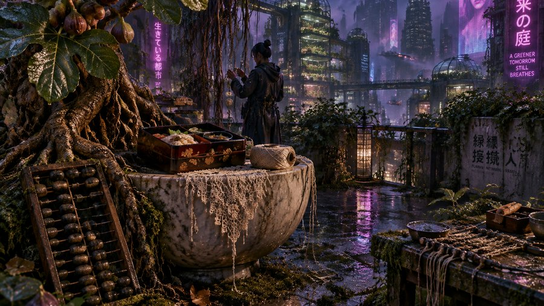
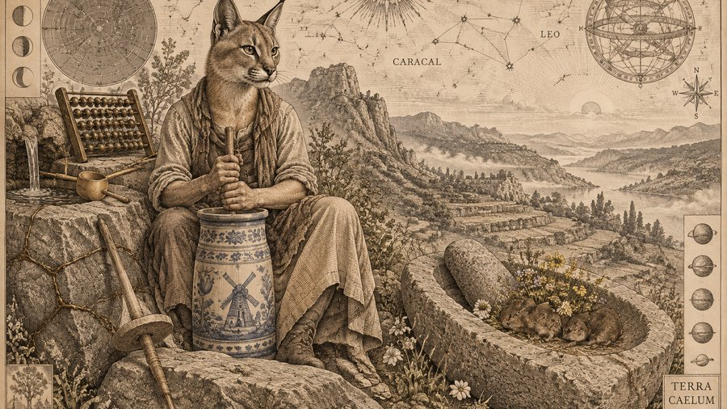
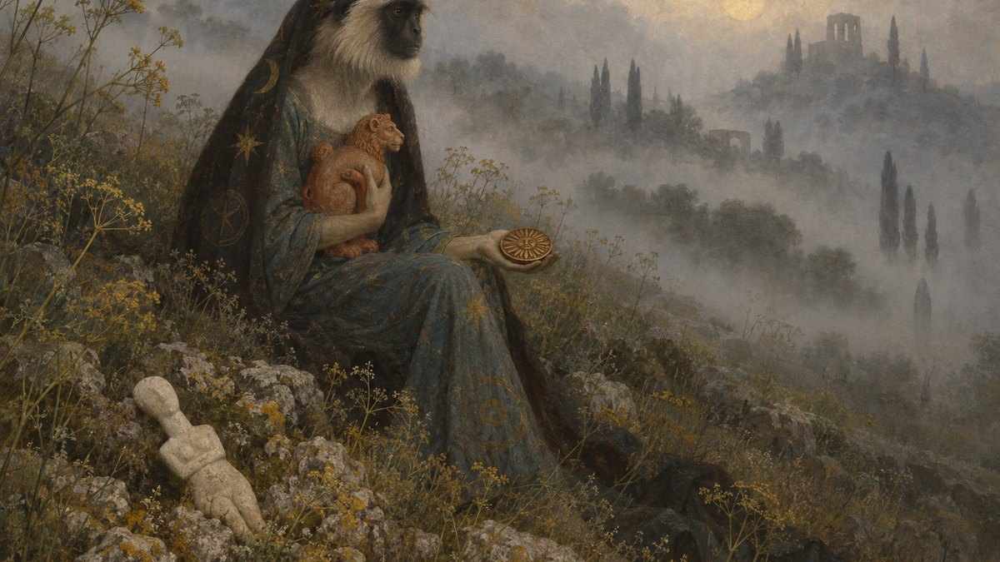
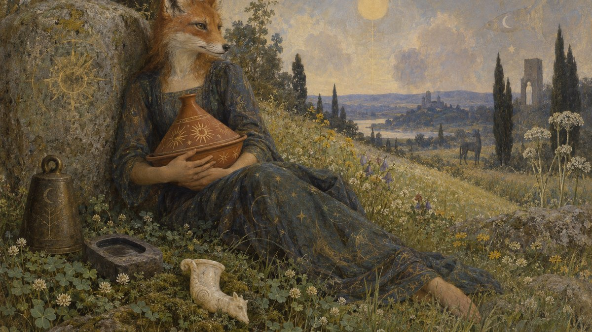

# Astro-Arc

**Your desktop, generated from your birth chart — every day.**

Astro-Arc is an [Omarchy](https://omarchy.org) bar-widget plugin. It reads your
natal astrology chart and the day's transits, turns them into a psychological
reading, turns that into a single image, renders it, and derives a matching
colour palette from the rendered image — so the wallpaper and the theme always
agree, because the theme is made *from* the wallpaper.

It runs on a cadence you pick, and every generation is browsable, exportable and
shareable.


---

## Seven art styles

Pick one from the widget, or write your own into
[`styles.toml`](backend/pipeline/styles.toml). These three are the same reading,
the same objects and the same two material registers — only the style differs:

| Ukiyo-e | Cyberpunk | Antique Engraving |
| --- | --- | --- |
|  |  |  |

**[See all seven →](docs/styles.md)**

---

## Why it looks different every day

The image's *subject* comes from your chart. So does its **shape**.

Four independent measurements of the day — how hard the aspects are, how exact,
how many, and how much of the Moon is lit — decide how many things are in the
frame, how many places they occupy, how long the prompt is, whether the two
material registers collide or cohere, where the event sits relative to you, and
how much the image *attempts* to hide in shadow.

A loaded, hard day is crowded and close. A quiet one is not.

That last one — light — is the only instruction a style can talk the renderer
out of, and it is worth showing honestly. Each row below is one style. Within a
row, everything is pinned except the day's exposure: same register, same
density, same number of objects. Only the chart differs.

| | A quiet, dark day | A quiet, bright day |
| --- | --- | --- |
| **Symbolist** |  |  |
| **Ghibli** |  |  |

Symbolist does what it is told: the dark day is genuinely fogbound and most of
the frame is lost in it. Ghibli mostly does not. Its own guidance asks for a
wide low horizon under an enormous sky, and when that collides with an
instruction to leave the frame unlit, the sky tends to win — so its "dark" day
arrives as a bright morning that merely happens to have mist in it.

Both rows are working as designed. The dial always follows the chart; the style
decides how much of that survives contact with the picture. Density and
distance come through in every style. Light is the one that negotiates.

---

## Requirements

- **Omarchy.** This is a bar-widget plugin; it does not run standalone.
- **An OpenAI API key.** Every stage is an API call, so a key is required
  regardless of which models you pick.

That is all. There is no install step: nothing is compiled, nothing is
downloaded, no service is registered. The backend runs on the Python and
ImageMagick every Omarchy install already has, using the standard library only,
and the chart maths is [Astronomy Engine](https://github.com/cosinekitty/astronomy),
vendored in this repository as a single file.

## Install

From Omarchy's plugin marketplace, or:

```sh
omarchy plugin add https://github.com/Gmacadoches/astro-arc.git --enable
```

Then click ✦ in the bar, paste your API key, and enter your birth date, time
and place.

Nothing generates on its own until you say so: **Schedule** starts at **None**,
so the first theme is the one you ask for with **Regenerate**. Set it to Hourly,
Daily, Weekly or Monthly once you know what a run costs you — the panel prices
the month for whichever you pick.

A schedule only advances while you are logged in, because the widget itself is
the scheduler. A locked screen still counts; being switched off, asleep or
logged out does not, and anything that came due during that runs within a few
minutes of your being back rather than being skipped.

**Update:** `omarchy plugin update garrett.astro-arc`. The plugin never
updates itself — the panel shows which release you are on and leaves the
updating to Omarchy.
**Remove:** `omarchy plugin remove garrett.astro-arc`. Your archive stays —
see below.

## Your archive

Every generation is kept as a page of its own — the image, the reading, the
prompt and what it cost — together with its complete theme, in
`~/.local/share/astro-arc/`. **Browse all generations** in the panel opens the
gallery, `~/.local/share/astro-arc/index.html`: every generation, newest first,
each linking to its page. Bookmark it.

Uninstalling the plugin leaves your archive untouched, because it was always
just files in your home directory. Delete the folder when you no longer want
it. *History* in Settings sets how long generations are kept; the newest is
never pruned.

## What it costs

Real measured costs, not estimates from a rate card. One preset sets every
model at once:

| Preset | Per run | Per month (daily) |
| --- | ---: | ---: |
| Low | $0.008 | **$0.23** |
| Medium | $0.011 | $0.32 |
| **High** *(recommended)* | $0.031 | **$0.93** |
| Ultra | $0.076 | $2.32 |
| Maximum | $0.210 | $6.39 |

Above roughly $0.05 a run, nothing got measurably better in testing — the upper
tiers buy a stronger *writing* model, not a better picture. Low already produces
a good image.

Figures are measured on this project's own renders and will drift as model
prices change; the widget always shows the live number, what your next click
will charge, and whether that figure is measured or projected.

You can set a hard ceiling per image, and every model your key can reach is
selectable in the Advanced popout if you want to tune it yourself.

## Sharing a theme

Any generation can be exported as a standalone Omarchy theme repository —
palette, wallpaper, preview thumbnail and README. Push it to a git host and
anyone can install it:

```sh
omarchy theme install https://github.com/you/omarchy-your-theme.git
```

Exports deliberately contain no personal content: the palette, the image and the
image prompt, never the reading that produced them.

## Your data

- **Your API key lives only in the system keyring** (`secret-tool`). Never in a
  file, an environment variable, a command line, or this repo. See
  `backend/bin/astro-arc-apikey`.
- **Your birth data and your readings stay on your machine**: settings in
  `~/.local/state/omarchy/settings/astro-arc.json`, caches in
  `~/.local/state/omarchy/astro-arc/` (safe to delete), your archive in
  `~/.local/share/astro-arc/`. Nothing in this repository contains them.
- Your prompts and chart facts are sent to OpenAI to generate each image, which
  is the entire mechanism — if that is not acceptable to you, this is not the
  tool for you. The birth place is looked up with Open-Meteo's geocoder, which
  also supplies its timezone.

## Tuning it

Several tables are plain TOML, read fresh on every run, so an edit takes effect
on the next generation with no restart and no code change. [`PIPELINE.md`](PIPELINE.md)
says which step each one changes:

| File | What it controls |
| --- | --- |
| `backend/pipeline/styles.toml` | the art styles and the worlds they belong to |
| `backend/pipeline/model-rates.toml` | model prices, quality presets, shortlists |
| `backend/pipeline/registers.toml` | the 25 material registers a scene is built from |
| `backend/pipeline/cliches.toml` | imagery to block when it starts recurring |

## Documentation

- [`PIPELINE.md`](PIPELINE.md) — **start here.** How one image gets made, step by
  step, with the config knob that changes each step. Written for someone who
  just forked this and wants to retune it without reading any Python. Also
  published as a page at [`docs/pipeline.html`](docs/pipeline.html), generated
  from that file by `backend/bin/build_pipeline_page.py` — edit the Markdown,
  run the script, never edit the HTML.
- [`RELEASING.md`](RELEASING.md) — how a release is cut (`bin/release`), why
  `master` only ever holds releases, and how updates find them.
- [`docs/styles.md`](docs/styles.md) — all seven art styles, same reading and
  same objects in each, so the style is the only variable.

Each script carries its own header comment explaining what it does and why it
does it that way; that is the reference for anything PIPELINE.md does not cover.

## Licence

[GNU Affero General Public License v3.0 or later](LICENSE).

Charts are computed with [Astronomy Engine](https://github.com/cosinekitty/astronomy)
by Don Cross, vendored unmodified in `backend/vendor/astronomy/` under the MIT
License. See [`NOTICE`](NOTICE) for the third-party notices.
