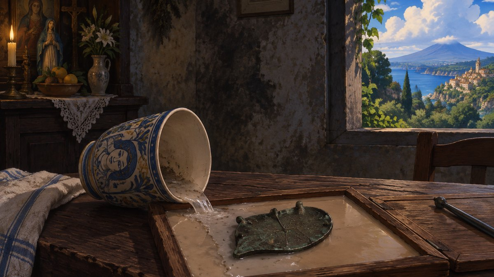

# Astro-Arc

**Your desktop, generated from your birth chart — every day.**

Astro-Arc is an [Omarchy](https://omarchy.org) bar-widget plugin. It reads your
natal astrology chart and the day's transits, turns them into a psychological
reading, turns that into a single image, renders it, and derives a matching
colour palette from the rendered image — so the wallpaper and the theme always
agree, because the theme is made *from* the wallpaper.

It runs on a cadence you pick, and every generation is browsable, exportable and
shareable.



---

## Why it looks different every day

The image's *subject* comes from your chart. So does its **shape**.

Four independent measurements of the day — how hard the aspects are, how exact,
how many, and how much of the Moon is lit — decide how many things are in the
frame, how many places they occupy, how long the prompt is, whether the two
material registers collide or cohere, where the event sits relative to you, and
how much is hidden in shadow.

A loaded, hard day is crowded and close. A quiet one is not.

| A quiet, dark day | A quiet, bright day |
| --- | --- |
|  |  |

Both are the same register at the same density. The difference is the chart.

---

## Requirements

- **Omarchy** (Hyprland + Quickshell). This is a bar-widget plugin; it does not
  run standalone.
- **Python 3.11+** (uses stdlib `tomllib`; developed against 3.14).
- **System tools**: `jq`, `secret-tool` (libsecret), `hyprctl`, `xdg-mime` —
  all standard on an Omarchy install.
- **An OpenAI API key.** Every stage is an API call, so a key is required
  regardless of which models you pick.

## Install

```sh
git clone https://github.com/Gmacadoches/astro-arc.git ~/Projects/astro-arc
cd ~/Projects/astro-arc
./install.sh
omarchy-restart-shell
```

`install.sh` symlinks `plugin/` and `backend/{bin,pipeline}` into the paths
Omarchy loads from, so edits in your checkout take effect on the next run. It
never copies your key anywhere — see **Your data** below.

Then open the widget, paste your API key, and enter your birth date, time and
place.

Nothing generates on its own until you say so: **Schedule** starts at **None**,
so the first theme is the one you ask for with **Regenerate**. Set it to Hourly,
Daily, Weekly or Monthly once you know what a run costs you — the panel prices
the month for whichever you pick.

A schedule only advances while the computer is on and you are logged in. A
locked screen still counts, so it keeps generating behind the lock screen;
being switched off, asleep or logged out does not, and anything that came due
during that runs shortly after you are back rather than being skipped.

## What it costs

Real measured costs, not estimates from a rate card. One preset sets every
model at once:

| Preset | Per run | Per month (daily) |
| --- | ---: | ---: |
| Low | $0.008 | **$0.23** |
| Medium | $0.011 | $0.32 |
| **High** *(recommended)* | $0.031 | **$0.93** |
| Ultra | $0.076 | $2.32 |
| Maximum | $0.210 | $6.39 |

Above roughly $0.05 a run, nothing got measurably better in testing — the upper
tiers buy a stronger *writing* model, not a better picture. Low already produces
a good image.

Figures are measured on this project's own renders and will drift as model
prices change; the widget always shows the live number, what your next click
will charge, and whether that figure is measured or projected.

You can set a hard ceiling per image, and every model your key can reach is
selectable in the Advanced popout if you want to tune it yourself.

## Sharing a theme

Any generation can be exported as a standalone Omarchy theme repository —
palette, wallpaper, preview thumbnail and README. Push it to a git host and
anyone can install it:

```sh
omarchy theme install https://github.com/you/omarchy-your-theme.git
```

Exports deliberately contain no personal content: the palette, the image and the
image prompt, never the reading that produced them.

## Your data

- **Your API key lives only in the system keyring** (`secret-tool`). Never in a
  file, an environment variable, a command line, or this repo. See
  `backend/bin/astro-arc-apikey`.
- **Your birth data and your readings stay on your machine**, under
  `~/.local/state/omarchy/astro-arc/`. Nothing in this repository contains them.
- Your prompts and chart facts are sent to OpenAI to generate each image, which
  is the entire mechanism — if that is not acceptable to you, this is not the
  tool for you.

## Tuning it

Several tables are plain TOML, read fresh on every run, so an edit takes effect
on the next generation with no restart and no code change:

| File | What it controls |
| --- | --- |
| `backend/pipeline/styles.toml` | the art styles and the worlds they belong to |
| `backend/pipeline/model-rates.toml` | model prices, quality presets, shortlists |
| `backend/pipeline/registers.toml` | the material vocabulary a scene is built from |
| `backend/pipeline/cliches.toml` | imagery to block when it starts recurring |

## Documentation

- [`CONTEXT.md`](CONTEXT.md) — full architecture: every script, how they connect,
  the conventions, and the reasoning behind the ones that look odd.
- [`CHANGELOG.md`](CHANGELOG.md) — what changed and, more usefully, what was
  measured and why each decision went the way it did.

## Licence

[MIT](LICENSE).
