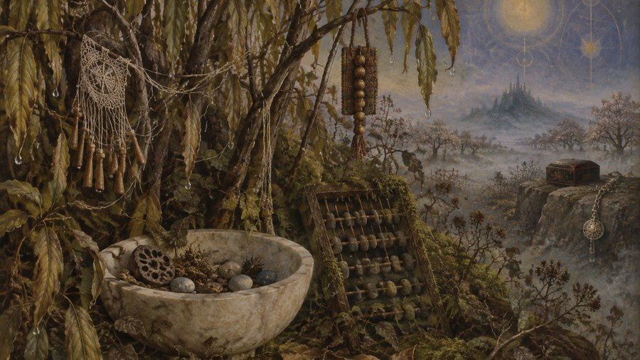
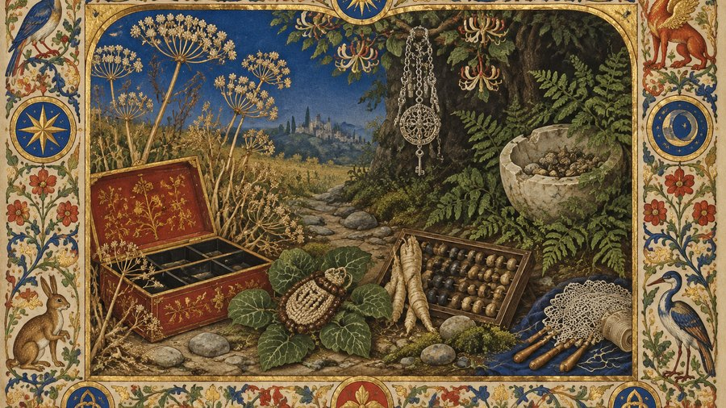

# Art styles

One sample per preset in [`backend/pipeline/styles.toml`](../backend/pipeline/styles.toml).

Every one of these is the **same** reading, the same visual signature, the
same Stage 1.5 objects, the same dial cell and the same two material
registers (`botanical` + `geological`). Only the style differs — otherwise this would be
seven different scenes rather than a comparison of styles.

Change the style from the widget's Style dropdown, or add your own preset
to `styles.toml` — it is read fresh on every generation.

## Symbolist / Visionary

`symbolist`

> A visionary/allegorical tradition — abstract, symbolic, or dreamlike forms (bodies dissolving into pattern, pure allegorical shapes) are natural here, alongside concrete objects and figures.

## Antique Engraving

`engraving`

> An illustrative, diagrammatic tradition — depicts discrete objects, figures, and symbolic diagrams in fine engraved linework. Avoid glowing/immaterial energy forms that can't be rendered as etched line art.

## Cosmic / Nebula

`cosmic`

> A visionary, abstract-friendly tradition — energy, light, nebulae, and dreamlike or symbolic forms are all welcome here, alongside concrete subjects.

## Studio Ghibli

`ghibli`

> A grounded, representational tradition — real people, animals, nature, weather, and architecture only, never abstract energy-beings, geometric abstraction, or immaterial forms. The qualities below are a way of rendering whatever your assigned register actually calls for, not a substitute subject list: things show real wear and weather (nature reclaiming or growing through the man-made, wind moving through whatever's present, structures aged by use), and reverence lives in humble, ordinary detail rather than grandeur. If the register is stone, machinery, water, cloth, a body, or anything else, that stays the actual subject — do not default to a cottage kitchen or domestic interior just because it fits this world comfortably; find the version of these qualities that belongs to your actual register instead (weathered, moss-softened stone for geological; a mechanism aged and lovingly maintained rather than sterile for mechanical). This world is at home with air and depth — a near object, a middle ground, and a far distance, often a wide low horizon under an enormous sky. It is equally at home with a single quiet place seen close: one corner of a meadow, a streambed, a stand of undergrowth, the foot of a tree. When the composition brief asks for few things or a single site, do NOT reach for the wide three-depth vista to compensate — fill the frame with this world's own greenery, weather, water and stonework instead. What to avoid is a bare isolated subject on an empty field, which is a different thing from a quiet scene densely full of world. Symbolic meaning should come from how a concrete, lived-in scene is composed, not from making the subject itself immaterial. Crucially, this world is entirely at home with the genuinely strange treated as completely ordinary: enormous unexplained machinery rusting in a meadow, a creature the size of a house asleep among ordinary trees, a derelict flying city, a shrine crowded with objects nobody living remembers the use of. Such things are always rendered heavy, weathered, physically solid and lit exactly like everything around them — never glowing, translucent or ethereal — and nobody in the frame is astonished by them. Use that register for anything in the scene that does not belong: keep it matter-of-fact and unremarked rather than softening it into something charming or explaining it away. Scenes here are not obliged to be warm or pleasant — this world also holds real dread, decay, blight, abandonment, and weather that means harm, rendered with the same solidity.

## Cyberpunk

`cyberpunk`

> A grounded science-fiction tradition — real people, streets, machinery, and architecture in a neon-lit future. Avoid abstract energy-beings or pure geometric abstraction; ground the symbolism in a concrete piece of tech, signage, or urban space instead.

## Ukiyo-e

`ukiyoe`

> A graphic, representational tradition — landscapes, figures, and everyday scenes rendered as flat stylized color planes, not painterly realism or abstract energy. Comfortable with bold pattern standing in for texture (waves, rain, fabric) but every subject should still read as a concrete, recognizable thing.

## Illuminated Manuscript

`illuminated`

> A decorative, symbol-friendly tradition — comfortable with both a flattened, iconic central figure/scene AND purely diagrammatic or symbolic content living in the border (astrological charts, emblems, vegetal patterns) without needing a literal figure at all. Not photorealistic or naturalistic; every image reads as a manuscript page, not a window onto a real scene.

